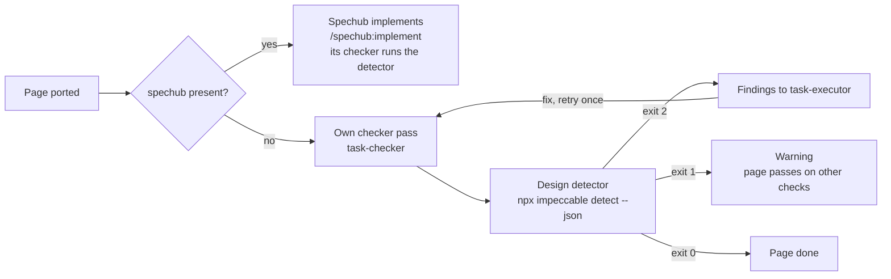

# Spechub-vs-self-contained map

Soft integration. If spechub is present, use its slash commands and agents. If not, orchestrate the same agent types directly.

## Detection

Check in this order:

1. `spechub/project.yaml` exists somewhere up the tree from the working directory.
2. Slash commands `/spechub:propose`, `/spechub:design`, `/spechub:implement`, `/spechub:implement-quick` are listed in the current session's available slash commands.
3. The `spechub` plugin directory exists under the plugin cache (`~/.claude/plugins/cache/.../spechub/`).

Any of these → **soft integration mode**.

This rule decides spechub and nothing else. impeccable is a different plugin with a different presence rule, and `../design-system/IMPECCABLE.md` holds it. Neither answer implies the other – a project can have spechub without impeccable, or impeccable without spechub.

## Full pipeline + spechub

### `/spechub:propose`

Synthesize a proposal from the exploration outputs and the resolved DS bundle. The prompt you feed spechub:

```
Integrate the open-designer page "<pageId>" of design "<design>" into
the codebase.

Design context:
- Resolved DS bundle: <bundle path>
  - tokens.css, voice.md, rules.md, gaps.md, components.md,
    routes.md, layouts.md, theme.md (all extends-resolved)
- Resolved design HTML: <bundle>/resolved/<pageId>.html
- Matched DS playable page: <bundle>/pages/<pageId>.html
- Tweak overrides to bake in: <chosen.tweaks as key=value list>

Backend gaps (must be addressed by this proposal):
- <list from Agent 3>

Target route / component (from clarification round):
- <user's chosen route>
- <user's chosen component strategy>

Navigation mapping (data-od-page → real-app primitive):
- <list from clarification round>

Real copy / data sources:
- <answers from clarification round>

DS fidelity – use only tokens in <bundle>/tokens.css. Apply voice.md
and rules.md to every ported surface. Do not invent new tokens unless
the user explicitly approves.

If the DS has not yet shipped into this codebase (no manifest.shippedAt),
Stage 1 of design-integrate has already handled that – the codebase's
tokens.css and doc locations are noted in the clarification answers.
```

### `/spechub:design`

After propose lands, feed the design command with the same design context plus the proposal outputs. Spechub's design phase turns the proposal into tasks.

### `/spechub:implement`

Launch the implementation loop. Stay available to answer context questions that come back from the test-writer / executor agents – especially "what does this element in the HTML correspond to in terms of existing components?".

## Quick path + spechub

### `/spechub:implement-quick`

Skip propose/design. Feed the same bundled context but compressed:

```
Quick-path integration of open-designer page "<pageId>" of design
"<design>".

Scope:
- <one-line description of the change>

Design context:
- Resolved DS bundle: <bundle path>
- Resolved design HTML: <bundle>/resolved/<pageId>.html
- Matched DS playable page: <bundle>/pages/<pageId>.html
- Tweak overrides: <chosen.tweaks as key=value list>
- Target: <component path>
- Navigation mapping: <list>

DS fidelity – use only tokens in <bundle>/tokens.css. Apply voice.md
and rules.md.
```

## Full pipeline + no spechub

Orchestrate subagents directly.

1. **test-writer agent** (`subagent_type: "spechub:test-writer"` if available, else `general-purpose`):
   ```
   Write failing tests for this behavior. The behavior is described by:
   - Resolved design HTML: <bundle>/resolved/<pageId>.html
   - Backend gaps to cover: <list>
   - User's clarified intent: <answers>

   Test placement follows existing conventions in the repo. Do NOT
   read any implementation files yet – tests are a spec.
   ```

2. **task-executor agent** (`subagent_type: "spechub:task-executor"` if available, else `general-purpose`):
   ```
   Make these failing tests pass. Tests are at <paths>. Design
   reference at <bundle>/resolved/<pageId>.html. Matched DS playable
   page at <bundle>/pages/<pageId>.html. Do not modify the tests. Use
   only tokens in <bundle>/tokens.css for visual work. Apply rules
   from <bundle>/rules.md and voice from <bundle>/voice.md.
   ```

3. **task-checker agent** (`subagent_type: "spechub:task-checker"` if available, else `general-purpose`):
   ```
   Verify the implementation at <paths>. Binary PASS/FAIL. Check:
   - All new tests pass
   - Typecheck clean
   - Lint clean
   - No regressions in existing tests
   - Visual match against <bundle>/resolved/<pageId>.html
   - Rules-lint pass against <bundle>/rules.md (gradients, accents,
     casing, punctuation)
   ```

4. **Design detector**, when impeccable is present. After task-checker returns
   PASS, run the section "Design detector (no spechub)" below.

## Quick path + no spechub

Skip test-writing for purely visual pieces.

1. **task-executor** directly:
   ```
   Apply this visual change to <component path>. Design reference at
   <bundle>/resolved/<pageId>.html. Tweak overrides: <key=value list>.
   Use only tokens in <bundle>/tokens.css. Apply rules from
   <bundle>/rules.md and voice from <bundle>/voice.md. Reuse the
   codebase components Agent 2 identified before creating new ones.
   Drop any data-od-page attributes from the shipped code; replace
   with the framework's nav primitive per the clarification answers.
   ```

2. **task-checker**:
   ```
   Verify <paths>. Typecheck + lint + existing tests + visual match
   against <bundle>/resolved/<pageId>.html. Rules-lint pass against
   <bundle>/rules.md – flag violations as warnings.
   ```

3. **Design detector**, when impeccable is present. After task-checker returns
   PASS, run the section "Design detector (no spechub)" below.

4. **frontend-verifier** (if available as `spechub:frontend-verifier`):
   ```
   Navigate to <route> after `npm run dev` and snapshot. Compare
   layout, colors, copy structure against <bundle>/resolved/<pageId>.html.
   ```

## Design detector (no spechub)

With spechub present, its task-checker already runs impeccable's design detector and this section does nothing. With spechub absent, the skill runs the detector itself, once per page, after task-checker returns PASS and before the frontend-verifier.

The detector is a static check. It reads files and starts no browser, so it replaces neither the rules-lint pass in Step 8 of `SKILL.md` nor the frontend-verifier.



1. **Decide whether impeccable is present.** Follow the presence rule in `../design-system/IMPECCABLE.md` and nothing else. Absent means the skill skips this section.

2. **Derive the file list.** The list is the paths task-executor reported changing for this page. Every executor report names its files. Confirm each path against the working tree:

    ```bash
    git status --porcelain
    ```

    - Use `git status` to validate the executor's list, never to build it. The command returns the whole working tree, so page two would rescan page one
    - Drop any path that carries a `D` status code. The detector cannot read a deleted file
    - Keep the new path of a rename. `git status` prints a rename as `R old -> new`
    - Drop every path under `.open-designer/`. Nothing there ships into the codebase
    - Pass files, never directories. A directory scan covers files the work never touched
    - An empty list means task-executor changed nothing. Skip the rest of this section

3. **Set the verdict.** This run alone decides whether the page passes. Run it from the project root:

    ```bash
    npx impeccable detect --json --no-advisory <file> [<file>...]
    ```

    | Exit code | What it means | What the skill does |
    |---|---|---|
    | 0 | No firm finding | Go to step 4 |
    | 2 | At least one firm finding. The JSON on stdout lists them | Go to step 5 |
    | Any other | The detector could not run | Report one warning line saying what the command printed. Skip steps 4 and 5; the page passes on the other checks |

4. **Collect the advisories.** Run the detector a second time over the same file list, without `--no-advisory`:

    ```bash
    npx impeccable detect --json <file> [<file>...]
    ```

    - Read the JSON. Every finding carrying `"advisory": true` becomes a note on the detector line of the Step 11 report in `SKILL.md`
    - An advisory is a suggestion. It never goes back to task-executor and it never blocks the page
    - Exit 0 and exit 2 both hold usable output. Say in one line that the advisory run failed under any other exit code, then continue

5. **Send the firm findings back to task-executor.** Only exit 2 reaches this step.

    - Send the JSON – each finding's `file`, `line`, `antipattern`, `snippet`, and `description` – with the same brief the executor already had
    - `line` is 0 for a finding that applies to the whole file
    - Add one line to that brief: "fix these detector findings without reintroducing hex literals; use the project's tokens by name"
    - Re-run task-checker, then repeat step 3
    - A FAIL from that re-run goes back to task-executor the way any checker FAIL does, before the detector runs again
    - Stop after that second verdict run. A second exit 2 goes to the user with the remaining findings, and the user decides what happens next
    - Do not stamp `chosen.shippedAt` (Step 10 in `SKILL.md`) when a page's verdict run ended on exit 2

## Notes

- Never paste the resolved HTML or the DS bundle files into prompts. Always reference by path. HTML and CSS can be large and pasting them blows the context budget.
- Always bundle the `chosen.tweaks` as a short key=value list – that is the exact visual state the user approved, and it's small enough to include inline.
- When both spechub and agent-browser are available, use the `spechub:browser-verify` skill for the visual verification step.
- If a subagent says "I don't have access to X", do not switch to a hack – stop and ask the user. Most of the time the right answer is "the user didn't run the dev server" or "spechub isn't installed here", which is a clarify-and-re-run, not a workaround.
