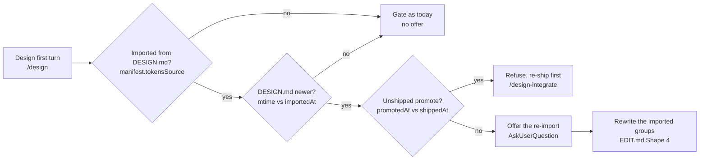

# Edit flow

Two payload shapes come from the viewer while the user is in Design systems mode, plus plain conversational edits and a re-import from `DESIGN.md`.

## Shape 1 – selection payload

Starts with `I selected an element in design system \`<ds>\`` (single element) or `I selected N elements in design system \`<ds>\`` (multi). Same format as the `design` skill's payload but with a different lead sentence and an extra `designSystem: <name>` context.

To apply:

1. Resolve the DS. Walk its `extends` chain so you have the full token context.
2. Locate the playable page – `design-systems/<ds>/pages/<page-id>/<variant>.html`.
3. For each element, find it by selector. Fall back to outer-HTML snippet if ambiguous.
4. Decide where the edit lands:
   - **Structural / markup change** – edit the playable page HTML.
   - **Visual change that already binds to a CSS variable** – adjust the variable in `tokens.css` at `:root`. Recommend promotion to the user one-liner: "Updated `tokens.css` – this will cascade to every design using `<ds>`."
   - **Visual change that doesn't yet bind to a variable** – ask: promote to DS (add a new token) or keep local to the playable page?
   - **Copy / tone change** – update `briefing/voice.md` and quote the new rule in the element.
   - **Structural "do not break" change** – add a rule to `briefing/rules.md` with a **Why:** line citing the element as evidence.
5. Bump `manifest.updatedAt` (ISO timestamp).
6. One-line reply to the user: which file changed and what.

Never silently promote a local tweak to the DS. Promotion is explicit – either the user clicks the Promote button, or you ask and they confirm.

## Shape 2 – Promote payload

The viewer's Promote button POSTs to `/data/design-systems/<ds>/promote` – the launcher applies it atomically. The skill only sees this when the user is asking about a specific change that was promoted and wants to understand what happened.

If the user pastes the toast text or asks "why did my tweak disappear?", explain: the Promote button wrote the value to `tokens.css` `:root`. The local tweak is now the default for every design that links this DS.

The launcher also stamps `manifest.promotedAt` and `manifest.updatedAt`. The next `/design-integrate` run reads that stamp, sees it is newer than `manifest.shippedAt`, and offers to re-ship the tokens into the codebase.

## Shape 3 – conversational edits

Plain-language requests. Route each by file:

- "add an amber success token" → `tokens.css` `:root` (add `--<prefix>-success-bg`, `--<prefix>-success-fg`). Update `preview/colors.html` to include the new swatch. Append a `briefing/components.md` note if a component should start using it.
- "banish exclamation points from voice" → `voice.md` – add the rule under a Punctuation section, cite the user's request as evidence.
- "document the 1px-border rule" → `rules.md`. Add rule, add **Why:** (what breaks when you drop to 0.5px), add **How to apply:** (which surfaces).
- "Geist Mono isn't self-hosted yet" → `gaps.md`. Never move the entry to `rules.md` until the font is actually vendored.
- "add a settings playable page" → create `pages/settings/01-default.html` plus the `pages/index.json` entry. Use DS tokens and the playable-page shape in `PAGES.md`.

Every conversational edit bumps `manifest.updatedAt`.

## Shape 4 – re-import from `DESIGN.md`

A DS whose tokens came from `DESIGN.md` goes stale when someone edits a token in the code. The code reaches `DESIGN.md` through impeccable's `document` playbook, and this shape carries `DESIGN.md` back into `tokens.css`.

Two things start it:

- A plain request, such as "re-import the tokens from DESIGN.md".
- The hand-off from the `design` skill's first-turn gate, which offers the re-import when the DS is older than `DESIGN.md`.



`DESIGN.md` is read-only here. The code is the only source of truth for tokens, `DESIGN.md` derives from the code, and this shape never writes either one (`IMPECCABLE.md`).

To apply:

1. **Refuse an unshipped promote.** The DS holds an unshipped promote in two cases:
    - `manifest.promotedAt` exists and `manifest.shippedAt` does not.
    - `manifest.promotedAt` is newer than `manifest.shippedAt`.

    Stop in either case with one line: re-ship through `/design-integrate` first. A manifest with no `promotedAt` carries no promote, so carry on.
2. **Re-run the 2b.3b mapping.** Read the current `DESIGN.md` and the `.impeccable/design.json` sidecar. Produce the properties the mapping table in `CREATE.md` §2b.3b names. Find `DESIGN.md` the way §2b.0 does – the project root, then `.agents/context/`, then `docs/`.
3. **Sort the properties into three sets.** The list in `manifest.importedProperties` holds the names the last import wrote:
    - Rewrite – every property step 2's mapping produces.
    - Removal – every name in `importedProperties` the mapping no longer produces.
    - Hand-added – every other property in `tokens.css`. Never touch one.

    An import from before `importedProperties` existed carries no such list. Fall back to §2b.3b's naming shapes for typography, radius, spacing, shadows, and motion. Ask before deleting any colour property.
4. **Rewrite only the properties the mapping produces.** Leave the rest of `tokens.css` alone:
    - Hand-added tokens.
    - The `@media (prefers-color-scheme: dark)` block.
    - The semantic base styles.
    - `--odp-preview-accent`.
5. **Treat a dropped property as a removal.** Apply the "Removing tokens" rule below to each name in the removal set. It greps the designs and warns the user first.
    - A property the user keeps stays in `tokens.css` and leaves `importedProperties`.
    - That property becomes hand-added, so no later re-import proposes it again.
6. **Update the previews.** Edit a card in `preview/` in two cases only:
    - A swatch or a sample names a token the re-import removed.
    - A swatch or a sample names a token the re-import added.

    A card picks up a changed value on its own, because it links `tokens.css`. The sidecar decides two whole cards (2b.6):

    - A sidecar that vanished. Delete `preview/shadows.html` and `preview/motion.html`, then drop their entries from `preview/index.json` if that file exists.
    - A sidecar that appeared. Emit both cards the way 2b.6 does.
7. **Update `gaps.md` for the sidecar.** The sidecar decides one `gaps.md` entry:
    - No sidecar this time. Write the entry §2b.3b writes – the skill imported no shadows or motion.
    - A sidecar that came back. Remove that entry.
8. **Refresh the `theme.md` pointer.** Its group list comes from §2b.3b. Rewrite that list when the set of imported groups changed:
    - A sidecar that appeared adds shadows and motion.
    - A sidecar that vanished drops them.

    Copy no value into `theme.md`.
9. **Stamp the manifest.** Write `importedAt` and `updatedAt`, both the current ISO timestamp. Write `importedProperties` again, holding the names step 2's mapping produced. Leave `tokensSource` as it is.
10. **Reply in one line.** Name the file and the three counts:

    ```
    Re-imported tokens.css from DESIGN.md – 6 properties changed, 2 added, 1 removed.
    ```

## New-token discipline

When adding a token:

1. Pick a name that follows the existing prefix (`--<prefix>-*`).
2. Add to `:root` in `tokens.css`. If the DS has dark mode, add a paired value under the `@media (prefers-color-scheme: dark)` block.
3. Add the swatch / sample to the matching `preview/*.html`.
4. If the token represents a concept not yet expressed anywhere (e.g. success color for a DS that had none), tell the user: "`<ds>` now exposes `--<prefix>-success-bg`. Want me to also add it to `briefing/components.md` so Claude knows to reach for it?"

If the user says no, leave `briefing/components.md` alone – the token exists but is available, not prescribed.

## Removing tokens

- Never remove a token without asking. Designs may be linking it.
- If the user confirms removal, grep `.open-designer/designs/` for `var(--<prefix>-<name>)`. If any design references it, warn them before deleting.

## Changing `extends`

- If the user wants to add or swap `extends:`, ask what the intent is. Common cases:
  - "Make `lightnote-mkt` inherit `lightnote`" → set `extends: "lightnote"` and drop any duplicate tokens from the child that match the parent exactly.
  - "Stop inheriting" → copy the resolved parent tokens into the child's `tokens.css` and remove `extends:` from `manifest.json`. Otherwise designs that used parent-only tokens will break.

## After any edit

Short one-line reply. Do not repeat the request back. Name the file and the nature of the edit. The user will see the result in the viewer's next refresh (hot reload picks it up automatically).
